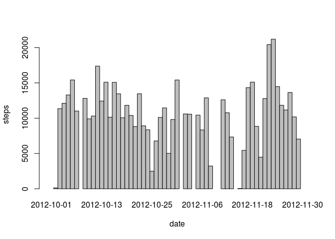
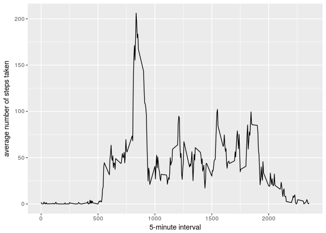
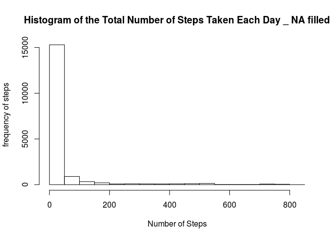
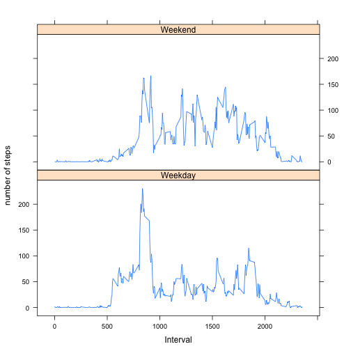

# Reproducible Research: Peer Assessment 1
Wut Hmone  
March 24, 2017  


## Loading and preprocessing the data

```r
library("dplyr")
```

```
## 
## Attaching package: 'dplyr'
```

```
## The following objects are masked from 'package:stats':
## 
##     filter, lag
```

```
## The following objects are masked from 'package:base':
## 
##     intersect, setdiff, setequal, union
```

```r
activity = read.csv("activity.csv")
activity = as.tbl(activity)
head(activity,10)
```

```
## # A tibble: 10 × 3
##    steps       date interval
##    <int>     <fctr>    <int>
## 1     NA 2012-10-01        0
## 2     NA 2012-10-01        5
## 3     NA 2012-10-01       10
## 4     NA 2012-10-01       15
## 5     NA 2012-10-01       20
## 6     NA 2012-10-01       25
## 7     NA 2012-10-01       30
## 8     NA 2012-10-01       35
## 9     NA 2012-10-01       40
## 10    NA 2012-10-01       45
```


## What is mean total number of steps taken per day?


```r
library(data.table)
```

```
## -------------------------------------------------------------------------
```

```
## data.table + dplyr code now lives in dtplyr.
## Please library(dtplyr)!
```

```
## -------------------------------------------------------------------------
```

```
## 
## Attaching package: 'data.table'
```

```
## The following objects are masked from 'package:dplyr':
## 
##     between, last
```

```r
activity2 <- data.table(activity)
total_steps <-activity2[,sum(steps),by="date"]
names(total_steps) <- c("date","Total_Steps_per_Day")
barplot(total_steps$Total_Steps_per_Day, names.arg=total_steps$date, xlab="date", ylab="steps", space = 0)
```

<!-- -->

```r
mean_per_day <- activity2[,list(mean(steps, na.rm = T)),by="date"]
names(mean_per_day) <- c("Date", "Mean Per Day")
head(mean_per_day,10)
```

```
##           Date Mean Per Day
##  1: 2012-10-01          NaN
##  2: 2012-10-02      0.43750
##  3: 2012-10-03     39.41667
##  4: 2012-10-04     42.06944
##  5: 2012-10-05     46.15972
##  6: 2012-10-06     53.54167
##  7: 2012-10-07     38.24653
##  8: 2012-10-08          NaN
##  9: 2012-10-09     44.48264
## 10: 2012-10-10     34.37500
```

```r
mean(total_steps$Total_Steps_per_Day, na.rm = T)
```

```
## [1] 10766.19
```

```r
median(total_steps$Total_Steps_per_Day, na.rm = T)
```

```
## [1] 10765
```


## What is the average daily activity pattern?

```r
library(ggplot2)
averages <-activity2[,list(mean_steps = mean(steps, na.rm = T)),by="interval"]
head(averages)
```

```
##    interval mean_steps
## 1:        0  1.7169811
## 2:        5  0.3396226
## 3:       10  0.1320755
## 4:       15  0.1509434
## 5:       20  0.0754717
## 6:       25  2.0943396
```

```r
ggplot(data=averages, aes(x=interval, y=mean_steps)) +
    geom_line() +
    xlab("5-minute interval") +
    ylab("average number of steps taken")
```

<!-- -->

```r
maxstep <- averages[averages$mean==max(averages$mean),]
head(maxstep)
```

```
##    interval mean_steps
## 1:      835   206.1698
```


## Imputing missing values

```r
activity$steps[is.na(activity$steps)] = mean(activity$steps, na.rm=TRUE)
head(activity,10)
```

```
## # A tibble: 10 × 3
##      steps       date interval
##      <dbl>     <fctr>    <int>
## 1  37.3826 2012-10-01        0
## 2  37.3826 2012-10-01        5
## 3  37.3826 2012-10-01       10
## 4  37.3826 2012-10-01       15
## 5  37.3826 2012-10-01       20
## 6  37.3826 2012-10-01       25
## 7  37.3826 2012-10-01       30
## 8  37.3826 2012-10-01       35
## 9  37.3826 2012-10-01       40
## 10 37.3826 2012-10-01       45
```

```r
activity_imput <- data.table(activity)
Impute_mean <-activity_imput[,list(mean_steps = mean(steps, na.rm = T), interval),by="date"]
head(Impute_mean,10)
```

```
##           date mean_steps interval
##  1: 2012-10-01    37.3826        0
##  2: 2012-10-01    37.3826        5
##  3: 2012-10-01    37.3826       10
##  4: 2012-10-01    37.3826       15
##  5: 2012-10-01    37.3826       20
##  6: 2012-10-01    37.3826       25
##  7: 2012-10-01    37.3826       30
##  8: 2012-10-01    37.3826       35
##  9: 2012-10-01    37.3826       40
## 10: 2012-10-01    37.3826       45
```

```r
median(Impute_mean$mean_steps, na.rm = T)
```

```
## [1] 37.3826
```

```r
hist(activity$steps,breaks = 20, main="Histogram of the Total Number of Steps Taken Each Day _ NA filled",ylab='frequency of steps', xlab="Number of Steps")
```

<!-- -->


## Are there differences in activity patterns between weekdays and weekends?


```{r}

library(plyr)

activity$wday <- as.factor(ifelse(weekdays( activity$date) %in% c("Saturday","Sunday"), "Weekend", "Weekday")) 

library(lattice)
total_num_steps_per_wday <- ddply(activity,.(interval, wday),summarise, mean_steps=mean(steps))
xyplot(mean_steps ~ interval |  
          wday, data = total_num_steps_per_wday, 
       layout = c(1, 2), ylab = "number of steps", xlab = "Interval", type = 'l')
```

<!-- -->
